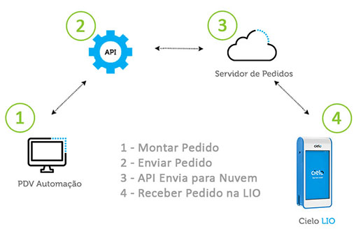

## Pacote integração Cielo Lio Remoto - PHP

O objetivo da Integração Remota da Cielo LIO é permitir que o lojista continue utilizando sua solução de frente de caixa (Automação Comercial ou PDV) e a integre com o módulo de pedidos e pagamentos da Cielo LIO através de uma API construída no padrão RESTful.<br>

Dessa forma, toda a gestão do estabelecimento comercial fica sob responsabilidade da Automação Comercial e, no momento de realizar o pagamento, a Cielo LIO é utilizada.

### Fluxo:



<hr>
### EM DESENVOLVIMENTO
<b>em desenvolvimento:</b><br>

### Como usar:

<b>Instalação: </b>
Para utilizar a biblioteca através do composer:

```php

composer require divulgueregional/cielo-lio-remoto

```

<br>

## Atualizar:

```php
composer update
```

<b>Ou pela última tag: </b>

```php
composer update divulgueregional/cielo-lio-remoto 1.0.0
```

<hr>

### Documentação:

Acesse a pasta docs e leia o README.md
<br>

<hr>

#### O QUE VOCÊ PODE UTILIZAR

<b>SEGURANÇA</b><br>

<!-- - Gerar o token
- Atualizar o token -->

<b>PAGAMENTO</b><br>

<!-- - Criar intenção de pagamento
- Alterar Modo Criação
- Buscar em intenção de pagamento
- Status do pagamento
- Lista de pagamento
- Lista de transações
- Buscar pagamento detalhado após pagamento
  <br>

<b>ESTORNO</b><br>

- Estornar um pagamento.
- Busca um estorno realizado. -->

## Autor:

Roseno Matos (developer) rosenomatos@gmail.com<br>

<!-- ## Licença:
A mercado-pago-point-smart é licenciado sob a Licença MIT (MIT). Você pode usar, copiar, modificar, integrar, publicar, distribuir e/ou vender cópias dos produtos finais, mas deve sempre declarar que Roseno Matos (rosenomatos@gmail.com) é o autor original destes códigos e atribuir um link para https://github.com/divulgueregional/api-bb-php -->

<!-- ## Comunidade:
## Facilitou sua vida?
Se o projeto o ajudou em uma tarefa excencial a sua aplicação de uma forma simples e se gostaria de contribuir com uma pequena doação ao autor, faça pelo PIX abaixo<br><hr>

Chave Pix E-MAIL: roseno@divulgueregional.com.br -->
